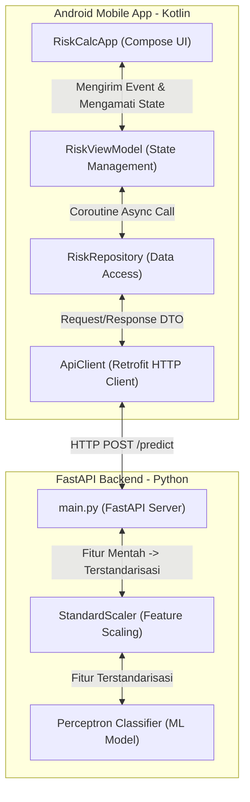

# RiskCalc Mobile App

Starter project aplikasi mobile Android native untuk RiskCalc menggunakan Kotlin dan Jetpack Compose.

## Stack Teknologi & Library

- **Kotlin**: Bahasa pemrograman modern utama untuk Android.
- **Jetpack Compose**: Toolkit deklaratif modern untuk merancang antarmuka (UI).
- **Material 3**: Panduan desain UI terbaru dari Google.
- **Retrofit (2.11.0)**: Library HTTP client untuk melakukan komunikasi data dengan API backend (FastAPI).
- **Gson Converter (2.11.0)**: Digunakan bersama Retrofit untuk mem-parse data JSON dari API menjadi objek Kotlin secara otomatis.
- **Lifecycle ViewModel Compose (2.10.0)**: Library untuk mengintegrasikan arsitektur MVVM (Model-View-ViewModel) agar manajemen state data di UI menjadi aman dan sesuai standar Android Jetpack.

---

## Struktur Project

- `app/` -> Modul Android utama.
  - `src/main/java/com/riskcalc/mobile/` -> Kode sumber utama Kotlin.
    - `MainActivity.kt` -> Entry point utama aplikasi.
    - `ui/RiskCalcApp.kt` -> Desain layout form input dan logika UI.
    - `ui/theme/` -> Konfigurasi tema warna, tipografi, dan gaya visual.

---

## Panduan Menjalankan Aplikasi (Running/Testing)

Kamu bisa menjalankan aplikasi ini langsung di **HP Android fisik** (sebagai pengganti emulator agar lebih ringan) menggunakan dua metode: via Android Studio atau langsung lewat Terminal.

### Persiapan HP Android (Contoh: Samsung S21+ / One UI)

Sebelum menjalankan aplikasi, kamu wajib mengaktifkan fitur debugging di HP kamu:

1. **Aktifkan Opsi Pengembang (Developer Options):**
   - Buka **Pengaturan (Settings)** -> **Tentang ponsel (About phone)** -> **Informasi perangkat lunak (Software information)**.
   - Ketuk **Nomor versi (Build number)** sebanyak **7 kali** sampai muncul tulisan "Mode pengembang telah diaktifkan".
   - Jika diminta, masukkan PIN/Kata Kunci layar kunci HP-mu.

2. **Aktifkan USB Debugging:**
   - Kembali ke menu utama **Pengaturan**.
   - Pilih menu paling bawah: **Pilihan pengembang (Developer options)**.
   - Cari dan aktifkan opsi **Proses debug USB (USB debugging)**.

3. **Khusus Samsung (Penting!): Matikan Auto Blocker:**
   - Jika HP Samsung-mu menggunakan One UI 6 ke atas, buka **Pengaturan** -> **Keamanan dan privasi (Security and privacy)**.
   - Pilih **Pemblokir Otomatis (Auto Blocker)** dan pastikan statusnya **Nonaktif (OFF)**. Jika aktif, laptop tidak akan bisa mengirim aplikasi ke HP.

4. **Hubungkan HP ke Laptop:**
   - Sambungkan menggunakan kabel data USB.
   - Setel mode USB ke **Mentransfer file (Transferring files)**.
   - Buka kunci HP, tunggu pop-up **"Izinkan debugging USB?"** muncul di layar HP, centang *"Selalu izinkan dari komputer ini"*, lalu ketuk **Izinkan (Allow)**.

---

### Metode A: Menjalankan Lewat Terminal (Tanpa Buka Android Studio)

Metode ini sangat disarankan setelah project pernah dibuka minimal sekali di Android Studio (untuk membuat file `gradlew.bat`).

Buka terminal di editor kamu (seperti Antigravity/VS Code) dan jalankan perintah berikut:

**Di Windows (PowerShell):**
```powershell
# 1. Daftarkan path compiler Java bawaan Android Studio
$env:JAVA_HOME="C:\Program Files\Android\Android Studio\jbr"

# 2. Build dan install aplikasi langsung ke HP kamu
.\gradlew.bat installDebug
```

**Di Linux / macOS (Bash):**
```bash
# 1. Daftarkan path compiler Java
export JAVA_HOME="/Applications/Android Studio.app/Contents/jbr/Contents/Home" # Sesuaikan path macOS/Linux

# 2. Jalankan perintah install
./gradlew installDebug
```

---

### Metode B: Menjalankan Lewat Android Studio UI

1. Buka folder `RiskCalc` ini menggunakan **Android Studio**.
2. Tunggu proses *Gradle Sync* selesai (status loading di pojok kanan bawah selesai).
3. Lihat ke toolbar atas Android Studio, pastikan nama HP Samsung/Android-mu sudah terdeteksi di dropdown device.
4. Klik tombol **Run** (ikon segitiga hijau ▶️) atau tekan shortcut `Shift + F10`.

---

### Metode B: Menjalankan Lewat Android Studio UI

1. Buka folder `RiskCalc` ini menggunakan **Android Studio**.
2. Tunggu proses *Gradle Sync* selesai (status loading di pojok kanan bawah selesai).
3. Lihat ke toolbar atas Android Studio, pastikan nama HP Samsung/Android-mu sudah terdeteksi di dropdown device.
4. Klik tombol **Run** (ikon segitiga hijau ▶️) atau tekan shortcut `Shift + F10`.

---

## 🗺️ Peta Arsitektur Sistem

Berikut adalah diagram alir proses data dari form aplikasi mobile hingga diklasifikasikan oleh engine Machine Learning di backend:



---

## ⚡ Cheatsheet Perintah Cepat

Daftar perintah praktis untuk menjalankan seluruh ekosistem aplikasi di terminal Windows (PowerShell):

### 1. Menjalankan FastAPI & ML Model
```powershell
# Masuk ke direktori backend
cd backend

# Aktifkan virtual environment
.\.venv\Scripts\Activate.ps1

# Latih model untuk menghasilkan file artifacts (.pkl)
python ml/train.py

# Jalankan server API backend
uvicorn main:app --reload
```

### 2. Forwarding Port PC ke HP Fisik (ADB Reverse)
*Agar aplikasi di HP fisik bisa menembak `localhost:8000` di laptop:*
```powershell
& "C:\Users\M S I\AppData\Local\Android\Sdk\platform-tools\adb.exe" reverse tcp:8000 tcp:8000
```

### 3. Build & Install Aplikasi Android ke HP
```powershell
# Set path JDK bawaan Android Studio
$env:JAVA_HOME="C:\Program Files\Android\Android Studio\jbr"

# Build dan pasang langsung ke HP yang terhubung via USB
.\gradlew.bat installDebug
```

---

## 🛠️ Panduan Troubleshooting (Masalah Umum)

Berikut beberapa error yang sering dijumpai beserta cara mengatasinya:

### 1. Error: `adb : The term 'adb' is not recognized...`
* **Masalah**: Windows tidak tahu di mana program `adb.exe` berada karena belum didaftarkan di environment PATH.
* **Solusi**: Panggil menggunakan path lengkap (absolute path) milik Android Studio:
  ```powershell
  & "C:\Users\M S I\AppData\Local\Android\Sdk\platform-tools\adb.exe" <perintah_adb>
  ```
  Atau tambahkan `C:\Users\M S I\AppData\Local\Android\Sdk\platform-tools` ke System Path Windows.

### 2. Error: HP Samsung Tidak Bisa Menginstal App / Tertolak ADB
* **Masalah**: Fitur keamanan *Auto Blocker* bawaan Samsung One UI memblokir laptop untuk mengirim file APK secara paksa.
* **Solusi**: Masuk ke **Pengaturan HP -> Keamanan dan privasi -> Pemblokir Otomatis (Auto Blocker)**, kemudian geser tombol ke posisi **Nonaktif (OFF)**.

### 3. Error: `To use the fastapi command, please install fastapi[standard]`
* **Masalah**: Perintah `fastapi dev` memerlukan paket opsional standard yang belum terinstal di virtual environment.
* **Solusi**: Jangan gunakan perintah `fastapi dev`, melainkan jalankan FastAPI secara langsung melalui Uvicorn (yang sudah terinstal):
  ```powershell
  uvicorn main:app --reload
  ```

### 4. Masalah: HP Fisik Tidak Bisa Terhubung ke Server Backend (Connection Timeout)
* **Masalah**: HP fisik menggunakan localhost (`127.0.0.1` atau `10.0.2.2`) tetapi tidak diarahkan ke server port lokal PC/laptop.
* **Solusi**: Pastikan HP terhubung via kabel data, lalu jalankan perintah **ADB Reverse**:
  ```powershell
  & "C:\Users\M S I\AppData\Local\Android\Sdk\platform-tools\adb.exe" reverse tcp:8000 tcp:8000
  ```

---

## 📋 Roadmap Pengembangan Berikutnya

- [x] **Integrasi API & Machine Learning**: Menghubungkan client Android native dengan API FastAPI menggunakan library Retrofit.
- [x] **ViewModel & Arsitektur MVVM**: Menerapkan arsitektur bersih Jetpack dengan `RiskViewModel` untuk mengelola state data input dan respons prediksi.
- [ ] **Pemisahan Komponen UI (Refactoring)**: Memisahkan form input menjadi file komponen modular yang terpisah (`RiskInputField.kt`, `RiskResultCard.kt`).
- [ ] **Validasi Input**: Menambahkan validasi data masukan pengguna di sisi Android sebelum data dikirim ke API (misalnya: usia tidak boleh kosong, dsb).

