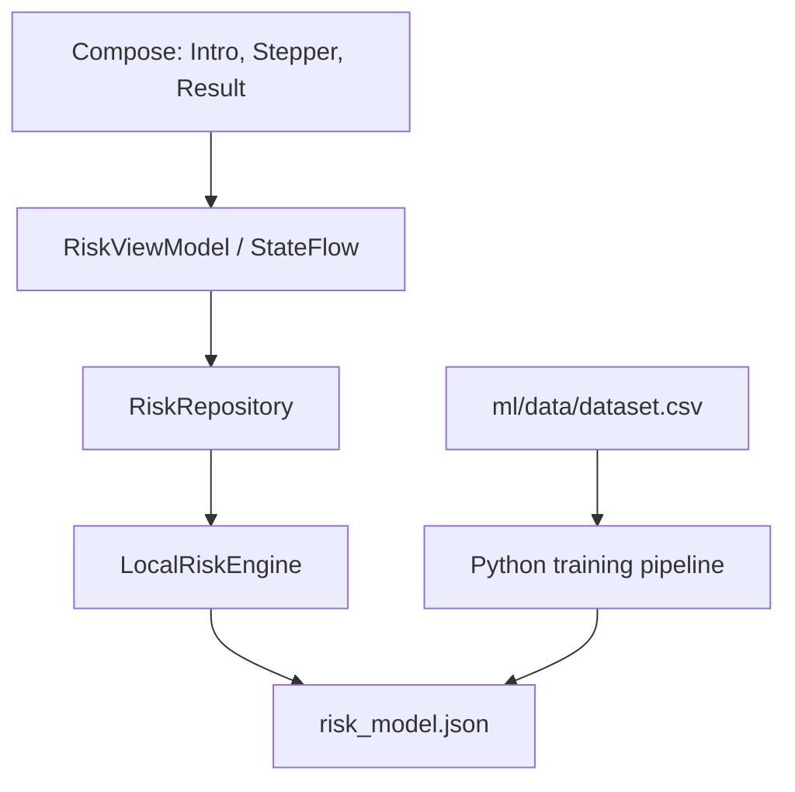

# Arsitektur RiskCalc V1

## Ringkasan

RiskCalc menggunakan single Activity, Jetpack Compose, Navigation 3, MVVM, dan inferensi Perceptron lokal. Aplikasi tidak membutuhkan backend, akun, database, atau koneksi internet.



## State dan Navigasi

- `IntroRoute`, `AssessmentRoute`, dan `ResultRoute` merupakan `NavKey` serializable untuk Navigation 3.
- `rememberNavBackStack` mempertahankan back stack saat configuration change.
- `RiskViewModel` menyimpan input primitif melalui `SavedStateHandle` dan mengekspos satu `StateFlow<RiskUiState>`.
- Hasil kompleks tidak dikirim sebagai navigation argument. Hasil dihitung dari state sesi dan repository lokal.
- `Periksa Lagi` menghapus input sesi. Tidak ada data yang disimpan ke disk aplikasi.

## Model Offline

`risk_model.json` memuat versi schema/model, SHA-256 dataset, urutan fitur, mean, scale, bobot, intercept, label kelas, dan margin borderline. Kotlin menghitung:

```text
standardized[i] = (input[i] - mean[i]) / scale[i]
margin = intercept + sum(weight[i] * standardized[i])
class = 1 jika margin >= 0, selain itu 0
```

Prediksi borderline menggunakan persentil ke-10 nilai absolut decision margin pada validation set.

## Keamanan dan Privasi

- Tidak ada permission internet.
- Android backup dinonaktifkan.
- Tidak ada histori, analytics, login, atau cloud sync.
- Copy hasil selalu menyatakan bahwa aplikasi adalah simulasi edukatif, bukan diagnosis.
